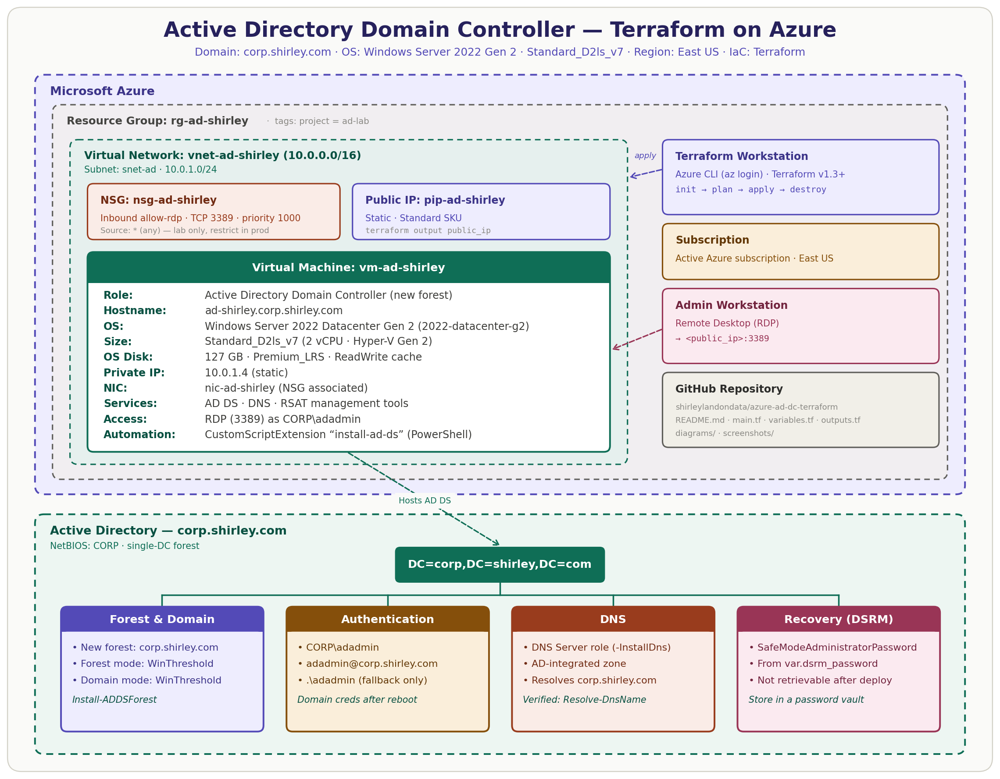
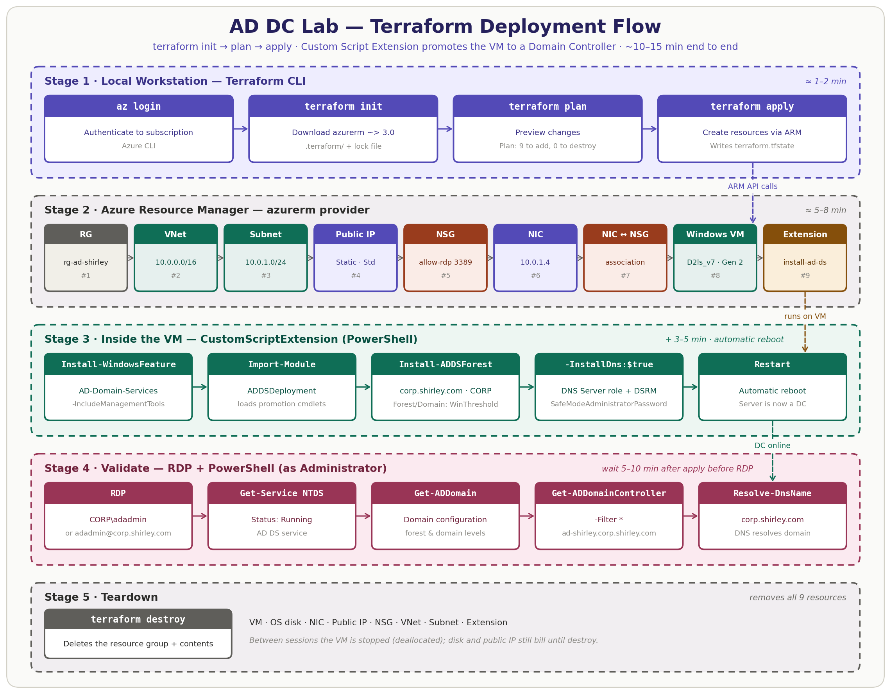
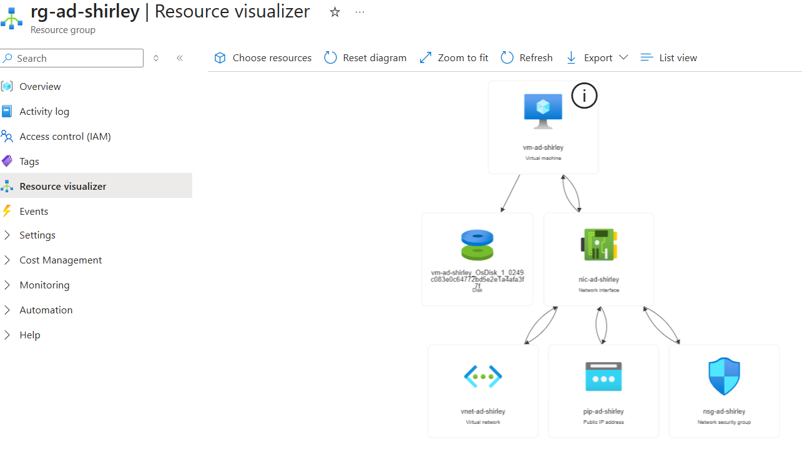
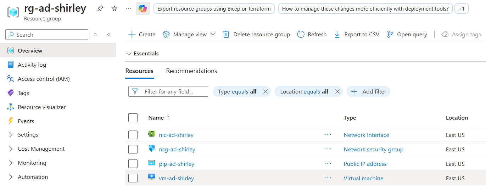
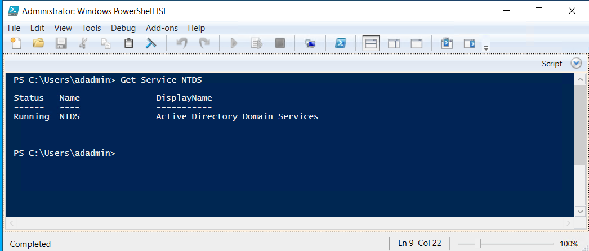
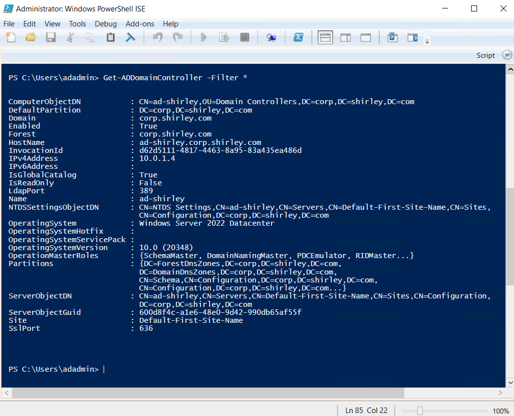
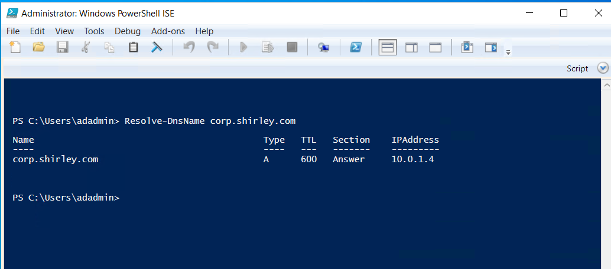
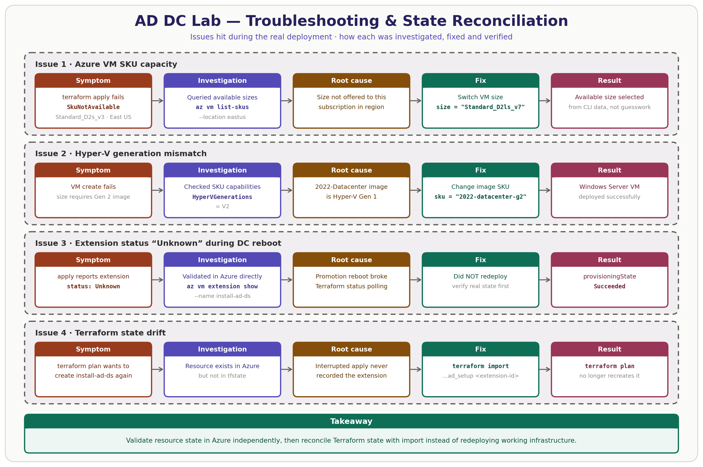
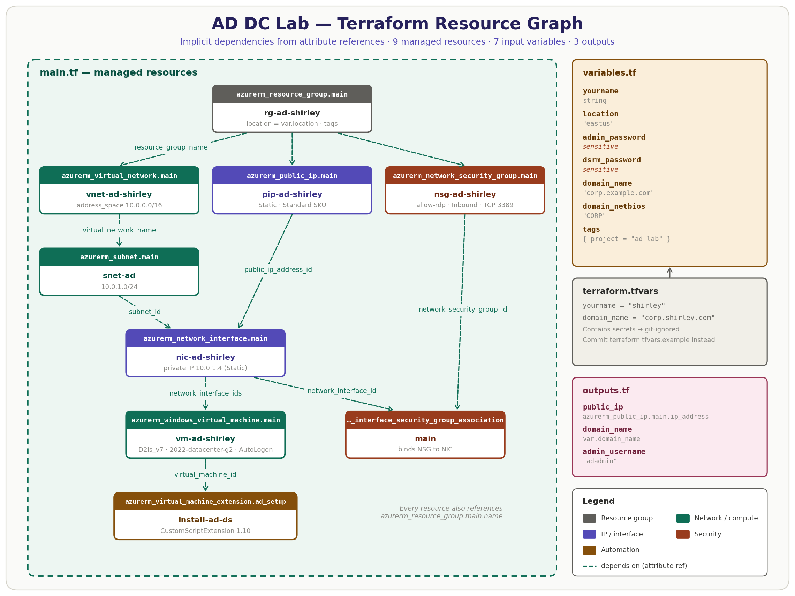

# Azure Active Directory Domain Controller — Terraform Deployment


> **Automated Azure infrastructure deployment for a Windows Server 2022 Active Directory Domain Controller using Terraform.**

This project deploys Azure networking, compute and identity infrastructure with Infrastructure as Code. Terraform provisions the Azure environment. An Azure Custom Script Extension then installs Active Directory Domain Services (AD DS), configures DNS and promotes the Windows Server VM to the first Domain Controller of the `corp.shirley.com` forest.

---

## Business Problem

Organizations need centralized identity and access management to securely manage users, computers, authentication and access to corporate resources. Deploying Windows Server infrastructure and configuring Active Directory by hand is slow and inconsistent, and it is hard to reproduce across environments.

This project shows how Infrastructure as Code (IaC) can automate the deployment of foundational identity infrastructure in Microsoft Azure.

Using Terraform, I provisioned the Azure networking and compute infrastructure required for a Windows Server 2022 Domain Controller. I then used an Azure Custom Script Extension to automate the installation of AD DS and DNS and the creation of a new Active Directory forest.

### Solution

The automated deployment creates:

- A dedicated Azure resource group
- A virtual network and subnet
- A Network Security Group
- Static public and private IP addressing
- A Windows Server 2022 virtual machine
- Active Directory Domain Services
- Integrated DNS
- A new `corp.shirley.com` Active Directory forest

The result is a repeatable infrastructure deployment. Version-controlled Terraform code replaces many manual Azure Portal and Windows Server configuration steps.

### Business Value

This approach shows how infrastructure automation helps IT and cloud teams:

- Standardize infrastructure deployments
- Reduce manual configuration and deployment errors
- Provision environments faster
- Keep infrastructure repeatable and auditable
- Apply consistent networking and identity configurations
- Rebuild environments from documented Infrastructure as Code

---

## Table of Contents

1. [Overview](#overview)
2. [Architecture](#architecture)
3. [What Gets Deployed](#what-gets-deployed)
4. [Deployment Evidence](#deployment-evidence)
5. [Troubleshooting & Engineering Decisions](#troubleshooting--engineering-decisions)
6. [Repository Structure](#repository-structure)
7. [How to Deploy](#how-to-deploy)
8. [Verification](#verification)
9. [Terraform Design](#terraform-design)
10. [Lab Design vs. Production Architecture](#lab-design-vs-production-architecture)
11. [Cost Management & Teardown](#cost-management--teardown)
12. [Skills Demonstrated](#skills-demonstrated)
13. [Lessons Learned](#lessons-learned)
14. [Future Enhancements](#future-enhancements)

---

## Overview

| | |
|---|---|
| **Goal** | Automate deployment of an Active Directory Domain Controller in Microsoft Azure |
| **IaC** | Terraform with the AzureRM provider |
| **Compute** | Windows Server 2022 Datacenter Gen 2 · `Standard_D2ls_v7` |
| **Directory** | `corp.shirley.com` · NetBIOS `CORP` |
| **Domain Controller** | `ad-shirley.corp.shirley.com` |
| **Private IP** | `10.0.1.4` |
| **Automation** | Azure Custom Script Extension + PowerShell |
| **Services** | Active Directory Domain Services + DNS |
| **Administration** | PowerShell, Azure CLI, RDP |

---

## Architecture

### Azure Architecture



**How it fits together:**

- **Network boundary:** a single VNet (`10.0.0.0/16`) with one subnet (`10.0.1.0/24`). The DC's NIC has a **static private IP (`10.0.1.4`)**. The Domain Controller also hosts DNS in this deployment, so a static private IP provides a stable address for domain and DNS services.
- **Ingress:** a Standard-SKU static public IP, with an NSG attached to the NIC that allows inbound RDP on TCP 3389.
- **Compute:** a Windows Server 2022 Datacenter **Gen 2** VM (`Standard_D2ls_v7`) on a 127 GB Premium SSD OS disk.
- **Configuration:** the `install-ad-ds` Custom Script Extension runs a single PowerShell command. It installs AD DS with the management tools, creates the forest, installs DNS and sets the DSRM password.

### Deployment Flow



---

## What Gets Deployed

| # | Terraform resource | Azure name | Purpose |
|---|---|---|---|
| 1 | `azurerm_resource_group.main` | `rg-ad-shirley` | Lifecycle boundary for every resource |
| 2 | `azurerm_virtual_network.main` | `vnet-ad-shirley` | `10.0.0.0/16` address space |
| 3 | `azurerm_subnet.main` | `snet-ad` | `10.0.1.0/24` subnet for the DC |
| 4 | `azurerm_public_ip.main` | `pip-ad-shirley` | Static, Standard SKU, used for RDP |
| 5 | `azurerm_network_security_group.main` | `nsg-ad-shirley` | `allow-rdp` inbound rule, TCP 3389, priority 1000 |
| 6 | `azurerm_network_interface.main` | `nic-ad-shirley` | Static private IP `10.0.1.4` + public IP |
| 7 | `azurerm_network_interface_security_group_association.main` | n/a | Attaches the NSG to the NIC |
| 8 | `azurerm_windows_virtual_machine.main` | `vm-ad-shirley` | Windows Server 2022 Gen 2 · `Standard_D2ls_v7` |
| 9 | `azurerm_virtual_machine_extension.ad_setup` | `install-ad-ds` | Installs AD DS + DNS and promotes the server to DC |

---

## Deployment Evidence

### Azure Architecture



Azure Resource Visualizer showing how the Windows Server VM, network interface, virtual network, public IP, Network Security Group and managed OS disk relate to each other.

### Azure Resources



The Terraform-provisioned resources in the `rg-ad-shirley` resource group.

### Active Directory & DNS



Windows Server 2022 running Active Directory Domain Services and DNS for the `corp.shirley.com` domain.

### Active Directory Verification



PowerShell confirming `ad-shirley.corp.shirley.com` as the Domain Controller, with static private IP `10.0.1.4`.

### DNS Verification



DNS resolving `corp.shirley.com` to the Domain Controller at `10.0.1.4`.

---

## Troubleshooting & Engineering Decisions

Several deployment issues needed investigation and remediation during this project.



### 1. Azure VM SKU Capacity

The original Terraform configuration specified `Standard_D2s_v3`. Azure returned a **`SkuNotAvailable`** error because that VM size wasn't available to my subscription in the East US region.

Rather than picking an arbitrary replacement, I used the Azure CLI to see which sizes were actually available:

```bash
az vm list-skus --location eastus --size Standard_D2 --resource-type virtualMachines --output table
```

### 2. Hyper-V Generation Compatibility

An alternative VM size failed at first because it required a **Hyper-V Generation 2** image, and the original Windows Server image (`2022-Datacenter`) is Generation 1.

I queried the SKU capabilities and confirmed that `Standard_D2ls_v7` was available and supports Hyper-V Generation 2:

```bash
az vm list-skus --location eastus --size Standard_D2ls_v7 \
  --query "[].capabilities[?name=='HyperVGenerations']" --output json
```

I then changed the Terraform image reference:

```diff
  source_image_reference {
    publisher = "MicrosoftWindowsServer"
    offer     = "WindowsServer"
-   sku       = "2022-Datacenter"
+   sku       = "2022-datacenter-g2"
    version   = "latest"
  }
```

This matched the image's Hyper-V generation to the VM size, and the Windows Server VM then deployed successfully.

### 3. Active Directory Extension State

The Custom Script Extension installed AD DS and started the Domain Controller promotion. During the reboot that promotion triggers, Terraform reported the extension's polling status as **`Unknown`**.

Rather than redeploying the extension, I checked its status directly in Azure:

```bash
az vm extension show \
  --resource-group rg-ad-shirley \
  --vm-name vm-ad-shirley \
  --name install-ad-ds \
  --query "provisioningState" --output tsv
# Succeeded
```

Azure reported the `install-ad-ds` extension as **`Succeeded`**.

### 4. Terraform State Reconciliation

Because Terraform lost track of the extension during the reboot, the next `terraform plan` tried to **create the extension again**, which would have re-run the promotion script against a server that was already a DC.

I retrieved the existing extension's Azure resource ID and imported it into Terraform state:

```bash
terraform import azurerm_virtual_machine_extension.ad_setup \
  /subscriptions/<subscription-id>/resourceGroups/rg-ad-shirley/providers/Microsoft.Compute/virtualMachines/vm-ad-shirley/extensions/install-ad-ds
```

A follow-up terraform plan confirmed that Terraform no longer attempted to recreate the extension. The remaining plan differences were in-place configuration/state drift rather than resource recreation, so I did not apply them to the verified working Domain Controller.

This showed why it matters to validate Azure resource state independently, and how to reconcile Terraform state after an interrupted provisioning operation.

### Quick Reference

| Symptom | Cause | Resolution |
|---|---|---|
| `SkuNotAvailable` on apply | The VM size isn't offered to this subscription in the region | Query `az vm list-skus` and choose an available size |
| VM create fails on a Gen 2-only size | Gen 1 image paired with a Gen 2 SKU | Use the `-g2` image SKU (`2022-datacenter-g2`) |
| Extension status `Unknown` | The DC promotion reboot interrupted Terraform's polling | Verify with `az vm extension show` before taking action |
| `plan` wants to recreate the extension | The resource exists in Azure but not in state | Run `terraform import` on the extension resource ID |
| RDP password rejected | Sign-in now uses domain credentials | Use `CORP\adadmin` or `adadmin@corp.shirley.com` |
| RDP black screen | The VM is still rebooting after promotion | Wait 5–10 minutes and retry |

---

## Repository Structure

```text
azure-ad-dc-terraform/
├── README.md
├── main.tf                    # Provider + 9 Azure resources + Custom Script Extension
├── variables.tf               # 7 input variables (2 marked sensitive)
├── outputs.tf                 # public_ip, domain_name, admin_username
├── terraform.tfvars.example   # Template: copy to terraform.tfvars (git-ignored)
├── .gitignore                 # Excludes state, .terraform/, and tfvars secrets
├── diagrams/
│   ├── architecture.png
│   ├── deployment-flow.png
│   ├── terraform-resource-graph.png
│   ├── troubleshooting-path.png
│   └── generate_diagrams.py   # Diagrams-as-code (matplotlib)
└── screenshots/
    ├── azure-ad-terraform-resource-architecture.png
    ├── azure-resource-group-terraform-deployment.png
    ├── server-manager-ad-ds-dns.png
    ├── ad-domain-controller-verification.png
    └── ad-dns-resolution-verification.png
```

---

## How to Deploy

**Prerequisites:** the Azure CLI (`az login`), Terraform v1.3+, an Azure subscription and an RDP client.

```bash
# 1. Authenticate and confirm the subscription
az login
az account show --output table

# 2. Configure variables (terraform.tfvars is git-ignored)
cp terraform.tfvars.example terraform.tfvars

# 3. Deploy
terraform init
terraform plan -out=tfplan
terraform apply tfplan

# 4. Get the RDP endpoint
terraform output public_ip
```

```hcl
# terraform.tfvars
yourname       = "shirley"
location       = "eastus"
admin_password = "<strong-admin-password>"
dsrm_password  = "<strong-dsrm-password>"
domain_name    = "corp.shirley.com"
domain_netbios = "CORP"
```

> ⚠️ **DSRM password:** the Directory Services Restore Mode password is separate from the admin password and **cannot be retrieved after deployment**. Store it in a password vault.

> ⏳ **Wait for the reboot:** the VM restarts automatically after the promotion. Wait 5–10 minutes after `apply` finishes before you connect over RDP. Then sign in with the domain account:

| Method | Username | When to use |
|---|---|---|
| Domain prefix | `CORP\adadmin` | Standard. Try this first. |
| UPN | `adadmin@corp.shirley.com` | If the domain prefix fails |
| Local account | `.\adadmin` | Only if the AD promotion failed |

---

## Verification

From the DC, in **PowerShell as Administrator**:

```powershell
Get-Service NTDS | Select-Object Name, Status   # AD DS service running
Get-ADDomain                                    # Domain + forest configuration
Get-ADDomainController -Filter *                # ad-shirley.corp.shirley.com · 10.0.1.4
Resolve-DnsName corp.shirley.com                # Resolves to 10.0.1.4
```

All four checks passed. See [Deployment Evidence](#deployment-evidence).

---

## Terraform Design



- **No explicit `depends_on` is needed.** Terraform infers the dependency graph from attribute references (`subnet_id`, `network_interface_ids`, `virtual_machine_id` and so on). Resources that don't depend on each other, such as the VNet, public IP and NSG, are created in parallel.
- **The NSG is associated at the NIC, not the subnet.** The rule applies to this single host only.
- **Names follow `<type>-ad-<yourname>`,** in line with the Azure CAF naming conventions.
- **Secrets are variables marked `sensitive = true`,** so Terraform redacts them in `plan`/`apply` output. They are still written to state (see below).

---

## Lab Design vs. Production Architecture

This deployment is a **lab**, and some shortcuts were taken on purpose. The table below separates what was built from what I would deploy in production.

| Lab design | Risk | Production architecture |
|---|---|---|
| NSG allows RDP from `*` | 3389 is exposed to the internet and gets brute-forced within minutes | Restrict `source_address_prefix` to trusted IPs, or remove the public IP and use **Azure Bastion** / JIT VM access |
| DSRM password in extension `settings` | `settings` is plain text and readable with `az vm extension show` | Move `commandToExecute` into **`protected_settings`** (encrypted and never returned) |
| Admin password in `AutoLogon` unattend content | The credential is written into the VM's unattend configuration | Remove AutoLogon, or rotate the password immediately after the build |
| Secrets in `terraform.tfvars` | Plaintext on disk | Source them from **Azure Key Vault** or `TF_VAR_*` environment variables |
| Local `terraform.tfstate` | State holds sensitive values in plain text, with no locking | Use a **remote backend** in Azure Storage with encryption, lease locking and RBAC |
| Single Domain Controller | No redundancy for authentication or DNS | Run ≥ 2 DCs across Availability Zones |
| Azure-provided DNS on the VNet | Member servers can't locate the domain | Set the VNet `dns_servers` to the DC IPs before joining clients |
| DC promotion reboot inside the CSE | Terraform loses track of the extension (see Issues 3 and 4) | Promote with `-NoRebootOnCompletion`, then restart separately, or use DSC / Azure Automation |

---

## Cost Management & Teardown

To control lab costs, I **stop and deallocate** the `Standard_D2ls_v7` VM when I'm not using it. Storage, the public IP and other Azure resources may keep incurring charges while they're retained.

```bash
az vm deallocate --resource-group rg-ad-shirley --name vm-ad-shirley
```

When the environment is no longer needed, one command removes the entire Terraform-managed deployment:

```bash
terraform destroy
```

---

## Skills Demonstrated

- **Infrastructure as Code:** Terraform, the AzureRM provider, variables, outputs, resource dependencies, state management
- **Microsoft Azure:** Virtual Machines, VNets, subnets, NICs, Public IPs, NSGs, managed disks, VM extensions
- **Windows Server 2022:** server administration and remote management
- **Active Directory:** AD DS installation, forest creation, Domain Controller promotion, domain authentication
- **DNS:** AD-integrated DNS installation and name-resolution validation
- **PowerShell:** Active Directory and Windows Server verification
- **Azure CLI:** authentication, VM SKU investigation, extension validation, resource inspection
- **Terraform Troubleshooting:** provider configuration, SKU constraints, VM/image compatibility, state reconciliation and resource import
- **Cloud Networking:** static private addressing, RDP connectivity, security groups and network interfaces
- **Security:** credential handling, `.gitignore`, sensitive Terraform variables, NSG exposure analysis and production-hardening recommendations

---

## Lessons Learned

1. **Check capacity before choosing a size.** SKU availability varies by subscription and region. `az vm list-skus` answers the question faster than trial-and-error applies.
2. **VM size and image generation have to match.** Newer VM families are Gen 2-only, so the image SKU (`-g2`) has to change with them.
3. **"Unknown" isn't the same as "failed."** When Terraform's view of a resource is uncertain, check what Azure actually reports before destroying or redeploying anything.
4. **Terraform state is a record, not the truth.** When the state and the real resources disagree, `terraform import` reconciles them without touching working infrastructure.
5. **After promotion, the identity context changes.** The local SAM account becomes a domain account, so `CORP\adadmin` is the credential to use.

---

## Future Enhancements

- [ ] Move the CSE command into `protected_settings` and pull secrets from Key Vault
- [ ] Separate the promotion reboot from the extension to avoid state drift
- [ ] Remote state backend in Azure Storage with state locking
- [ ] Replace the public RDP endpoint with Azure Bastion
- [ ] Set VNet custom DNS to the DC and add a domain-joined member server
- [ ] Add a second DC in a separate Availability Zone
- [ ] Bootstrap OUs, groups, users and a baseline GPO with PowerShell
- [ ] Add `terraform fmt -check`, `validate` and `tflint` in GitHub Actions

---

<sub>Diagrams are generated from code in [`diagrams/generate_diagrams.py`](diagrams/generate_diagrams.py).</sub>
